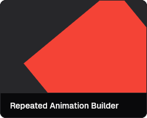

# shadcn_flutter
A set of widgets and utilities for building applications in flutter.
Optimized for web applications.
This is a port of the shadcn UI package to flutter.

Widget Catalog: [shadcn_flutter](https://sunarya-thito.github.io/shadcn_flutter/)

## Installation
### 1. Create a new Flutter project
```bash
flutter create my_app
cd my_app
```
### 2. Add the dependency
```bash
flutter pub add shadcn_flutter
```
### 3. Import the package
```dart
import 'package:shadcn_flutter/shadcn_flutter.dart';
```
### 4. Use the widgets
```dart
void main() {
  runApp(
    ShadcnApp(
      title: 'My App',
      home: MyHomePage(),
      theme: ThemeData(
        brightness: Brightness.dark,
        colorScheme: ColorSchemes.darkZync(),
        radius: 0.5,
      ),
    ),
  );
}
```
### 5. Add the fonts
Add the following fonts to your `pubspec.yaml` file.
```yaml
  fonts:
    - family: "GeistSans"
      fonts:
        - asset: "packages/shadcn_flutter/fonts/Geist-Black.otf"
          weight: 800
        - asset: "packages/shadcn_flutter/fonts/Geist-Bold.otf"
          weight: 700
        - asset: "packages/shadcn_flutter/fonts/Geist-Light.otf"
          weight: 300
        - asset: "packages/shadcn_flutter/fonts/Geist-Medium.otf"
          weight: 500
        - asset: "packages/shadcn_flutter/fonts/Geist-SemiBold.otf"
          weight: 600
        - asset: "packages/shadcn_flutter/fonts/Geist-Thin.otf"
          weight: 100
        - asset: "packages/shadcn_flutter/fonts/Geist-UltraBlack.otf"
          weight: 900
        - asset: "packages/shadcn_flutter/fonts/Geist-UltraLight.otf"
          weight: 200
        - asset: "packages/shadcn_flutter/fonts/Geist-Regular.otf"
          weight: 400
    - family: "GeistMono"
      fonts:
        - asset: "packages/shadcn_flutter/fonts/GeistMono-Black.otf"
          weight: 800
        - asset: "packages/shadcn_flutter/fonts/GeistMono-Bold.otf"
          weight: 700
        - asset: "packages/shadcn_flutter/fonts/GeistMono-Light.otf"
          weight: 300
        - asset: "packages/shadcn_flutter/fonts/GeistMono-Medium.otf"
          weight: 500
        - asset: "packages/shadcn_flutter/fonts/GeistMono-Regular.otf"
          weight: 400
        - asset: "packages/shadcn_flutter/fonts/GeistMono-SemiBold.otf"
          weight: 600
        - asset: "packages/shadcn_flutter/fonts/GeistMono-Thin.otf"
          weight: 100
        - asset: "packages/shadcn_flutter/fonts/GeistMono-UltraBlack.otf"
          weight: 900
        - asset: "packages/shadcn_flutter/fonts/GeistMono-UltraLight.otf"
          weight: 200
```
### 6. Run the app
```bash
flutter run
```

## Web Preloader Installation
### 1. Create a web directory
```bash
flutter create . --platforms=web
```
### 2. Create a "flutter_bootstrap.js" file
Create a new file in the web directory named "flutter_bootstrap.js" with the following content.
```javascript
//
// some words for the preloaders
const words = [
    'Something is happening. Please wait.',
    'Please be patient. This may take a while.',
    'While you wait, please consider that this is a good time to take a break.',
    'Please wait. This is a good time to go grab a cup of coffee.',
    'Sometimes the things that are worth waiting for take time.',
    'Please wait. This is a good time to stretch your legs.',
    'Posture check! Please wait while we load the application.',
];
const shadcnLoaderConfig = {
    loaderWidget: `
        <div style="padding-right: 32px; padding-bottom: 32px; font-smooth: always; display: flex; flex-direction: column; align-items: end">
            Loading Application...
            <div id="words" style="font-size: 16px; opacity: 0.6; font-weight: 300">
            ${words[Math.floor(Math.random() * words.length)]}
            </div>
        </div>`,
    backgroundColor: '#09090b',
    foregroundColor: '#ffffff',
    loaderColor: '#3c83f6',
    fontFamily: 'Geist Sans',
    fontSize: '24px',
    fontWeight: '400',
    mainAxisAlignment: 'end',
    crossAxisAlignment: 'end',
    externalScripts: [
        {
            src: 'https://cdn.jsdelivr.net/npm/@fontsource/geist-sans@5.0.3/400.min.css',
            type: 'stylesheet',
        },
        {
            src: 'https://cdn.jsdelivr.net/npm/@fontsource/geist-sans@5.0.3/300.min.css',
            type: 'stylesheet',
        },
    ]
}

//

function getSharedPreferences() {
    let sharedPreferences = {};
    // get all items from localStorage that starts with 'flutter.'
    for (let key in localStorage) {
        if (key.startsWith('flutter.')) {
            let sharedPreferencesKey = key.substring(8);
            sharedPreferences[sharedPreferencesKey] = localStorage.getItem(key);
        }
    }
    return sharedPreferences;
}

{{flutter_js}}
{{flutter_build_config}}

const loaderStyle = `
    display: flex;
    justify-content: ${shadcnLoaderConfig.mainAxisAlignment};
    align-items: ${shadcnLoaderConfig.crossAxisAlignment};
    position: fixed;
    top: 0;
    left: 0;
    right: 0;
    bottom: 0;
    background-color: ${shadcnLoaderConfig.backgroundColor};
    color: ${shadcnLoaderConfig.foregroundColor};
    z-index: 9998;
    font-family: ${shadcnLoaderConfig.fontFamily};
    font-size: ${shadcnLoaderConfig.fontSize};
    font-weight: ${shadcnLoaderConfig.fontWeight};
    text-align: center;
    transition: opacity 0.5s;
    opacity: 1;
    pointer-events: initial;
`;

const loaderBarCss = `
/* HTML: <div class="loader"></div> */
.loader {
//  width: calc(80px / cos(45deg));
  height: 7px;
  background: repeating-linear-gradient(-45deg,${shadcnLoaderConfig.loaderColor} 0 15px,#000 0 20px) left/200% 100%;
  animation: l3 20s infinite linear;
  position: fixed;
  top: 0;
  left: 0;
  right: 0;
  z-index: 9999;
}
@keyframes l3 {
    100% {background-position:right}
}`;

function createStyleSheet(css) {
    const style = document.createElement('style');
    style.type = 'text/css';
    style.appendChild(document.createTextNode(css));
    document.head.appendChild(style);
}

function loadScriptDynamically(src, callback) {
    if (typeof src === 'string') {
        src = { src: src, type: 'script' };
    }
    if (src.type === 'script') {
        const script = document.createElement('script');
        script.src = src.src;
        script.onload = callback;
        document.body.appendChild(script);
    } else if (src.type === 'module') {
        const script = document.createElement('script');
        script.type = 'module';
        script.src = src.src;
        script.onload = callback;
        document.body.appendChild(script);
    } else if (src.type === 'stylesheet') {
        const link = document.createElement('link');
        link.rel = 'stylesheet';
        link.href = src.src;
        link.onload = callback;
        document.head.appendChild(link);
    } else {
        throw new Error('Unknown type of file to load: ' + src);
    }
}

const loaderDiv = document.createElement('div');
loaderDiv.style.cssText = loaderStyle;
loaderDiv.innerHTML = shadcnLoaderConfig.loaderWidget;

document.body.appendChild(loaderDiv);

document.body.style.backgroundColor = shadcnLoaderConfig.backgroundColor;

const loaderBarDiv = document.createElement('div');
loaderBarDiv.className = 'loader';
loaderDiv.appendChild(loaderBarDiv);

createStyleSheet(loaderBarCss);

window.onAppReady = function() {
    loaderDiv.style.opacity = 0;
    loaderDiv.style.pointerEvents = 'none';
    delete window.onAppReady;
};

function loadExternalScripts(index, onDone) {
    if (index >= shadcnLoaderConfig.externalScripts.length) {
        onDone();
        return;
    }
    loadScriptDynamically(shadcnLoaderConfig.externalScripts[index], () => {
        loadExternalScripts(index + 1, onDone);
    });
}

function loadApp() {
    let externalScriptIndex = 0;
    loadExternalScripts(externalScriptIndex, () => {
        _flutter.loader.load({
            onEntrypointLoaded: async function(engineInitializer) {
                const appRunner = await engineInitializer.initializeEngine();
                await appRunner.runApp();
            }
        });
    });
}

loadApp();
```
### 3. Customize the preloader
You can customize the preloader by changing the `shadcnLoaderConfig` object in the "flutter_bootstrap.js" file.
For example, you can change the loader widget, background color, font family, font size, etc.
### 4. Run the app
```bash
flutter run -d chrome
```

## Widgets

### Animation
[](https://sunarya-thito.github.io/shadcn_flutter/#/components/animated_value_builder)
[](https://sunarya-thito.github.io/shadcn_flutter/#/components/repeated_animation_builder)

### Disclosure
[](https://sunarya-thito.github.io/shadcn_flutter/#/components/accordion)
[](https://sunarya-thito.github.io/shadcn_flutter/#/components/collapsible)

### Feedback
[](https://sunarya-thito.github.io/shadcn_flutter/#/components/alert)
[](https://sunarya-thito.github.io/shadcn_flutter/#/components/alert-dialog)
[](https://sunarya-thito.github.io/shadcn_flutter/#/components/circular-progress)
[](https://sunarya-thito.github.io/shadcn_flutter/#/components/progress)
[](https://sunarya-thito.github.io/shadcn_flutter/#/components/skeleton)


### Forms
[](https://sunarya-thito.github.io/shadcn_flutter/#/components/button)
[](https://sunarya-thito.github.io/shadcn_flutter/#/components/checkbox)
[](https://sunarya-thito.github.io/shadcn_flutter/#/components/color-picker)
[](https://sunarya-thito.github.io/shadcn_flutter/#/components/combo-box)
[](https://sunarya-thito.github.io/shadcn_flutter/#/components/date_picker)
[](https://sunarya-thito.github.io/shadcn_flutter/#/components/form)
[](https://sunarya-thito.github.io/shadcn_flutter/#/components/input)
[](https://sunarya-thito.github.io/shadcn_flutter/#/components/input_otp)
[](https://sunarya-thito.github.io/shadcn_flutter/#/components/radio_group)
[](https://sunarya-thito.github.io/shadcn_flutter/#/components/slider)
[](https://sunarya-thito.github.io/shadcn_flutter/#/components/switch)
[](https://sunarya-thito.github.io/shadcn_flutter/#/components/text_area)
[](https://sunarya-thito.github.io/shadcn_flutter/#/components/toggle)

### Layout
[](https://sunarya-thito.github.io/shadcn_flutter/#/components/card)
[](https://sunarya-thito.github.io/shadcn_flutter/#/components/carousel)
[](https://sunarya-thito.github.io/shadcn_flutter/#/components/divider)
[](https://sunarya-thito.github.io/shadcn_flutter/#/components/steps)

### Navigation
[](https://sunarya-thito.github.io/shadcn_flutter/#/components/breadcrumb)
[](https://sunarya-thito.github.io/shadcn_flutter/#/components/pagination)
[](https://sunarya-thito.github.io/shadcn_flutter/#/components/tabs)
[](https://sunarya-thito.github.io/shadcn_flutter/#/components/tab_list)


### Surfaces
[](https://sunarya-thito.github.io/shadcn_flutter/#/components/dialog)
[](https://sunarya-thito.github.io/shadcn_flutter/#/components/drawer)
[](https://sunarya-thito.github.io/shadcn_flutter/#/components/popover)
[](https://sunarya-thito.github.io/shadcn_flutter/#/components/sheet)
[](https://sunarya-thito.github.io/shadcn_flutter/#/components/tooltip)

### Data Display


### Data Display
[](https://sunarya-thito.github.io/shadcn_flutter/#/components/avatar)
[](https://sunarya-thito.github.io/shadcn_flutter/#/components/code-snippet)

### Utilities
[](https://sunarya-thito.github.io/shadcn_flutter/#/components/badge)
[](https://sunarya-thito.github.io/shadcn_flutter/#/components/calendar)
[](https://sunarya-thito.github.io/shadcn_flutter/#/components/command)