# shadcn_flutter
A set of widgets and utilities for building applications in flutter.
Optimized for web applications.
This is a port of the shadcn UI package to flutter.

Widget Catalog: [shadcn_flutter](https://sunarya-thito.github.io/shadcn_flutter/)

## Usage
```dart
import 'package:shadcn_flutter/shadcn_flutter.dart';

void main() {
  runApp(MyApp());
}

class MyApp extends StatelessWidget {
  @override
  Widget build(BuildContext context) {
    return ShadcnApp(
      title: 'My App',
      theme: ThemeData(
        brightness: Brightness.dark,
        colorScheme: ColorSchemes.darkZync(),
        radius: 0.5,
      ),
      home: MyHomePage(),
    );
  }
}
```

## Widgets

### Disclosure
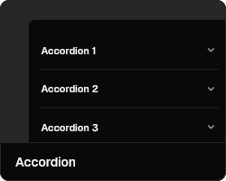


### Feedback


### Forms

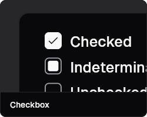
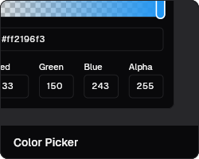
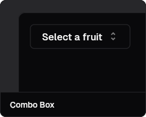
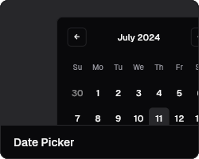
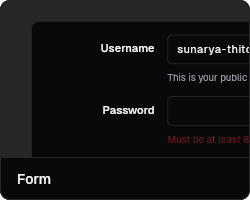


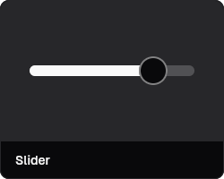


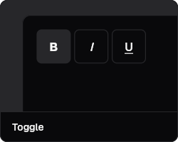

### Layout


### Navigation
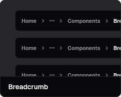
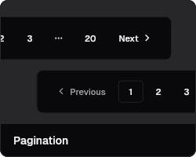
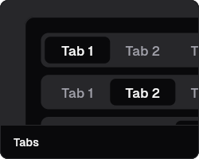


### Surfaces


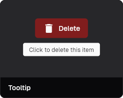

### Data Display

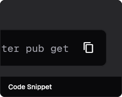

### Utilities


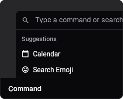